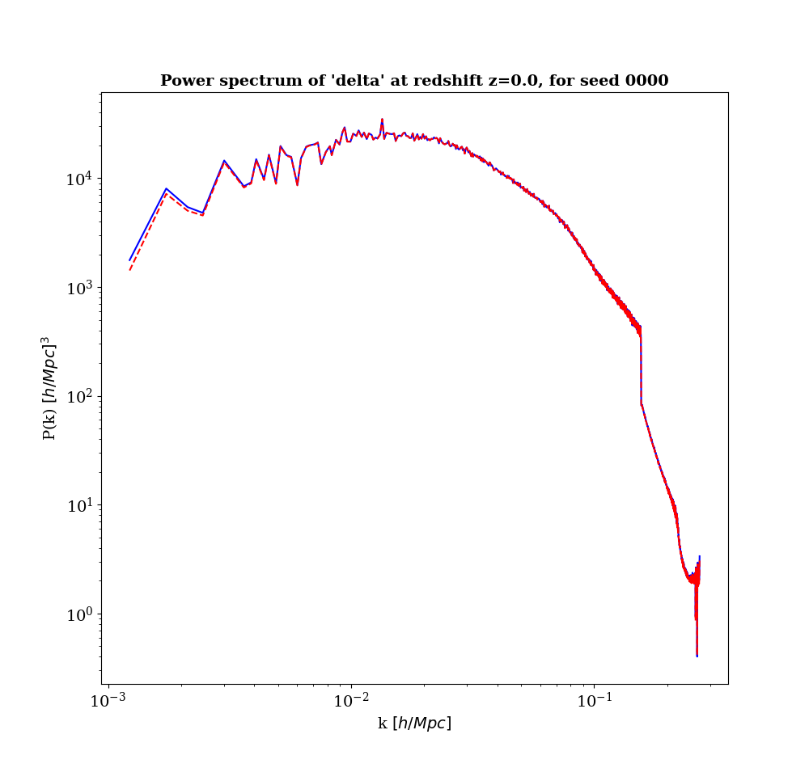
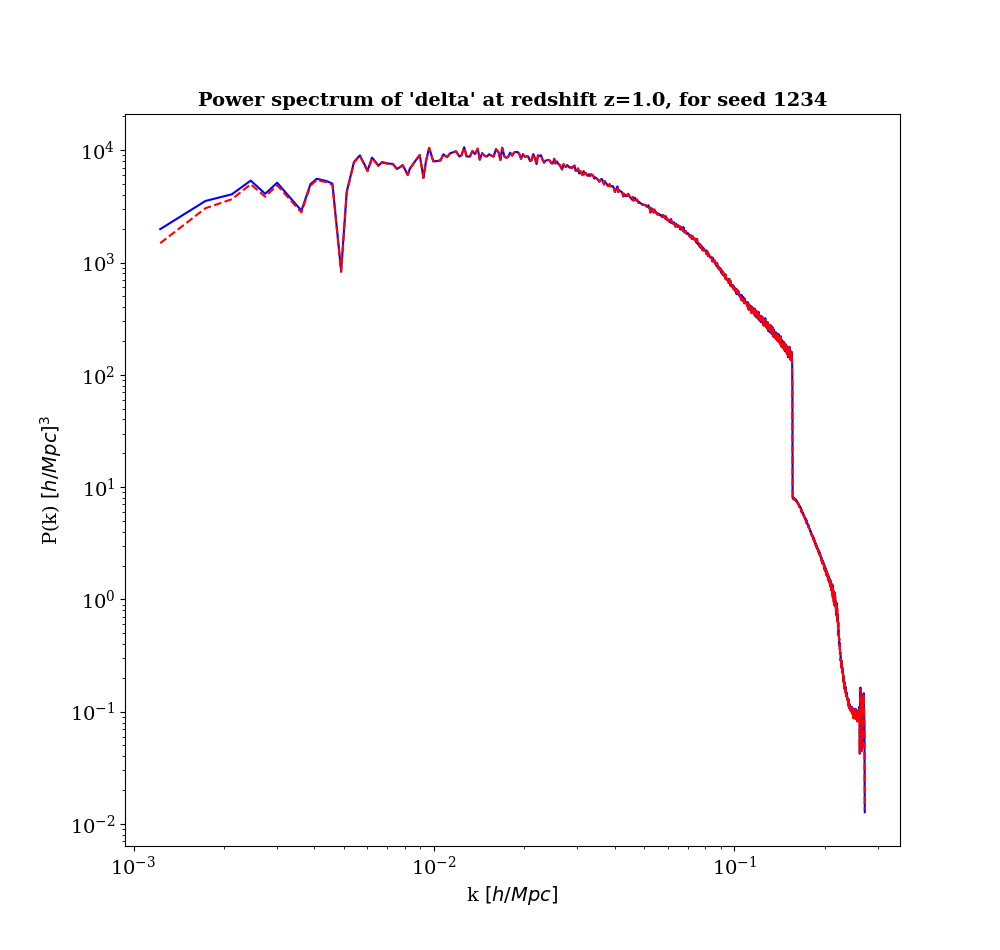
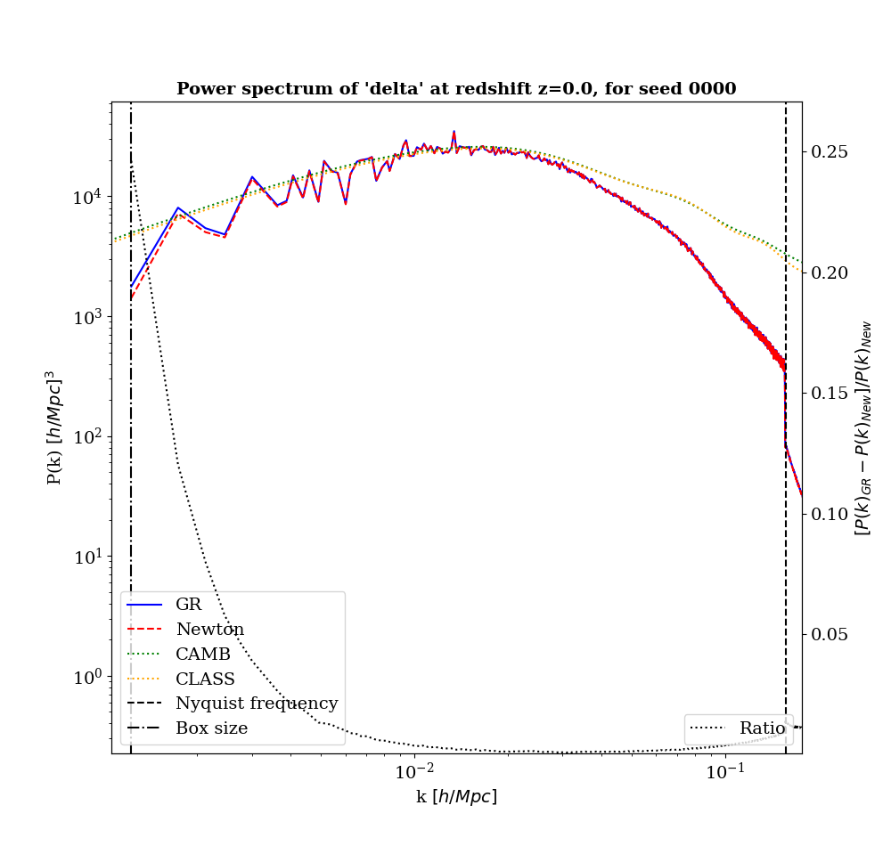
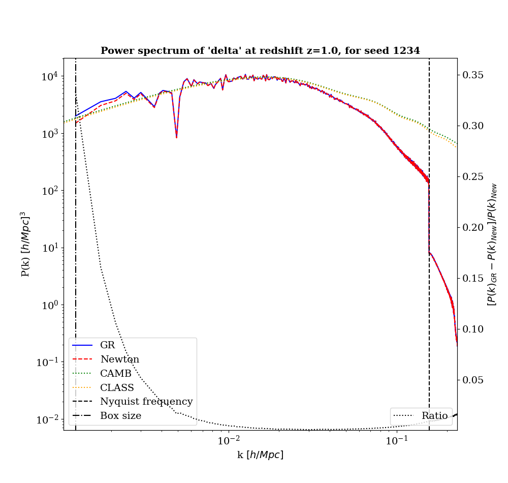
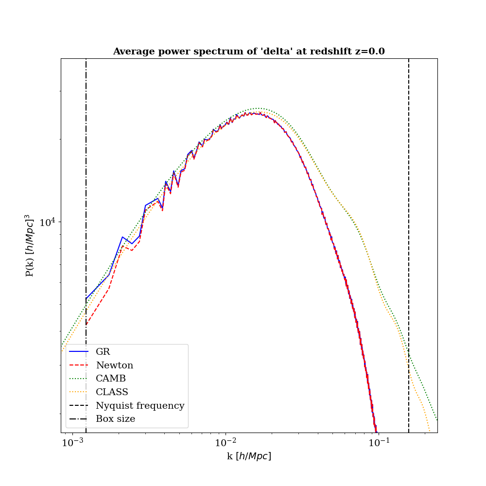
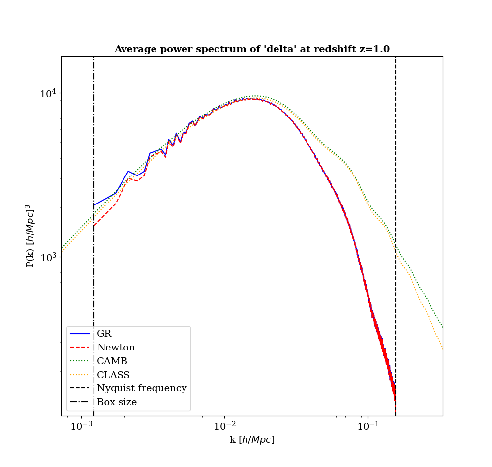
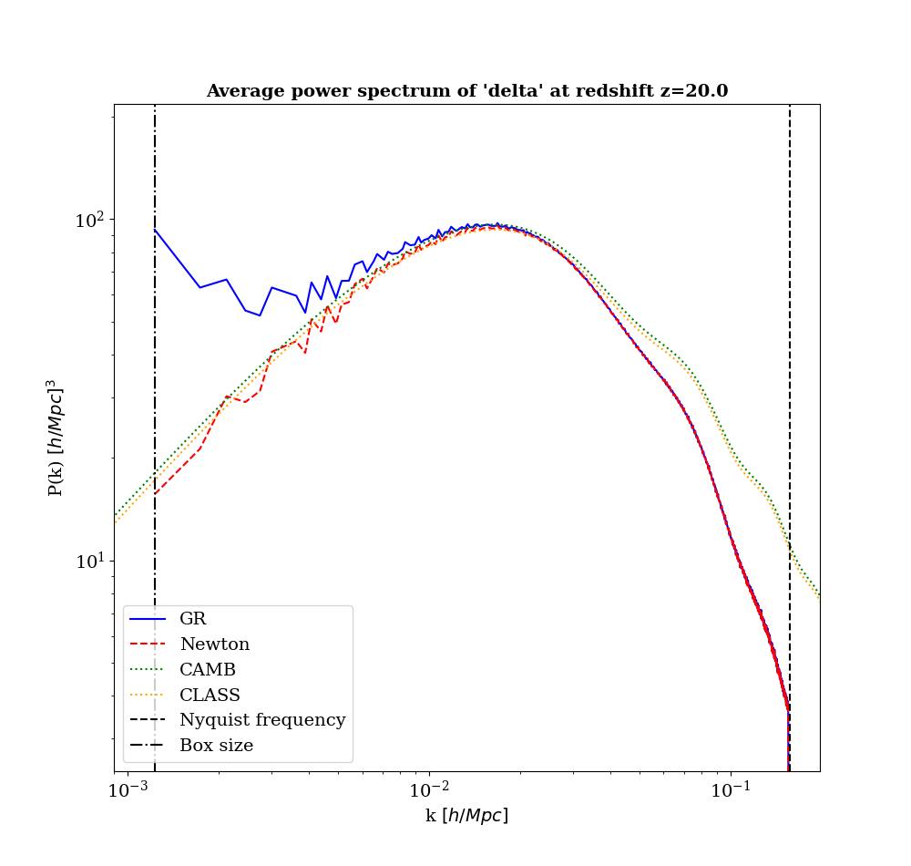

# Week 34 - 21.aug to 25.aug

## Status
So, I have continued working with the datacubes and the power spectra produced by gevolutoin. I Have established that there is a difference between the power spectra from GR and Newton as outputed from gevolutoin. Last week I had an error in the plots showing overlapping power spectra, where I indeed plotted the same spectra twice with different labels. 

Unable to do any work with pylians due to major issues with the imports on the UiO computers. Not yet resolved. Unsure how to proceed. 

## Current results

Box size and Nyquist frequencies are naivly calculated as:

$res=boxsize/ngrid$

$k_{nyq} = \frac{\pi}{res}$

$k_{box} = \frac{2\pi}{boxsize}$

  
  

Power spectra only.

    
    

Power spectra compared with CLASS and CAMB.

## Further things to do here:

- Gauge analysis on large scales.
- Compute the matter- and bispectra directly from the datacubes themselves using Pylians (or similar)

## Next major topic - ML pipeline
- Have demonstrated that this works on small scales.
- Failry easy to set up.
- Start testing/training small CNNs and then rescale to larger more complicated architectures. 
- What data to train on:
    - Datacubes are of $\phi$. 
    - Can easily make the dataset return the gradient $\nabla\phi$ or laplacian $\nabla^2\phi$ which would augment the dataset. 